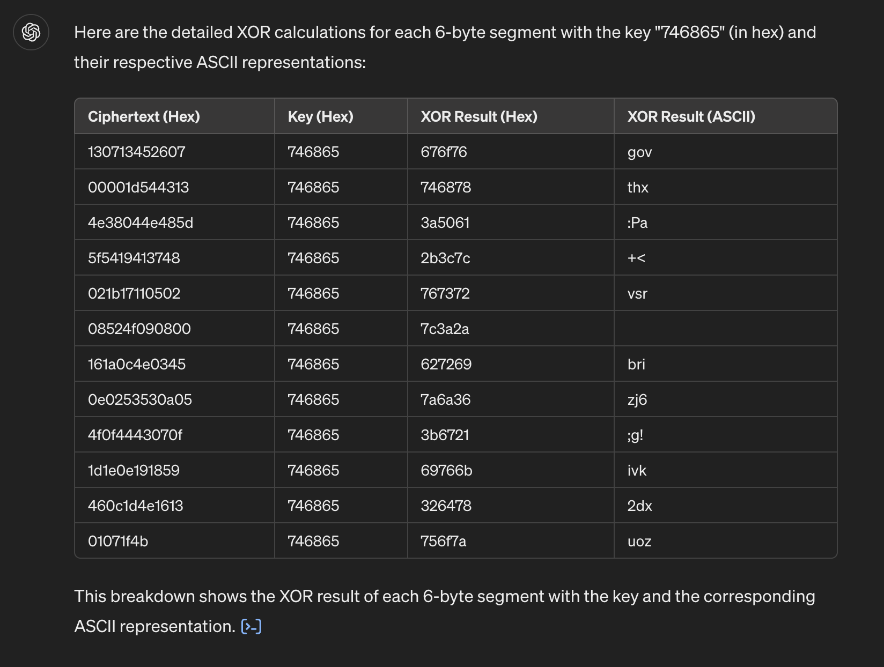
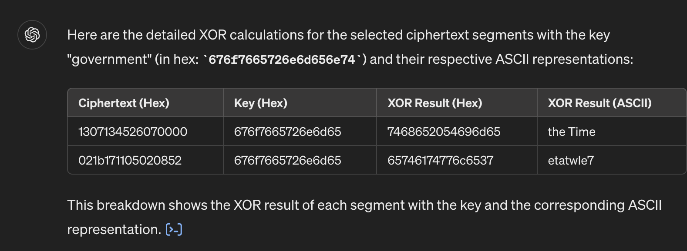
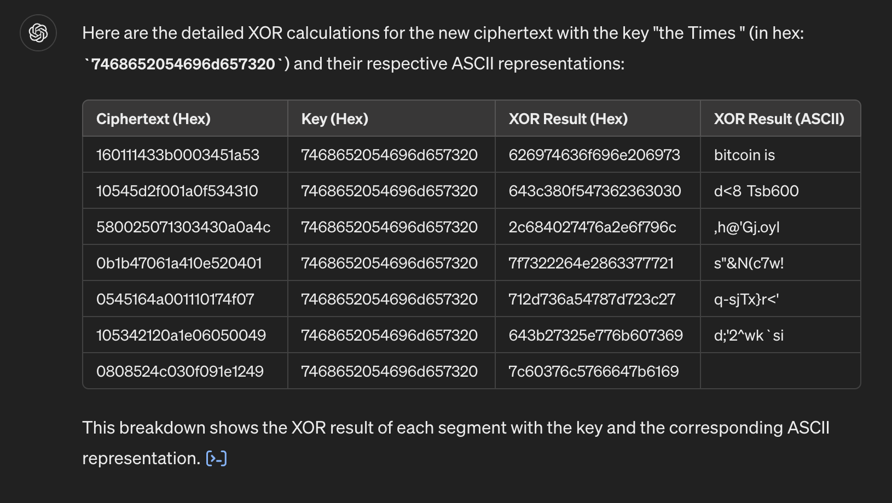
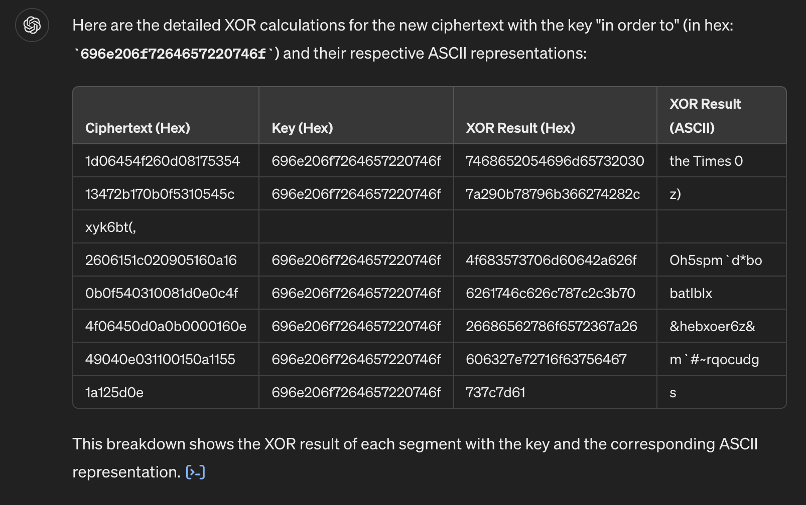

# Many Time Pad

## Hypothesis
We assume that the text is in English, as the conversation occurs between US and UK.

## Thought process
From the formulas equivalence, we started googling for help and we found this interesting solution called "crib drag":
https://crypto.stackexchange.com/a/10163.

We've generated all possible ciphertexts with the script [`generate_ciphers_xor.py`](./generate_ciphers_xor.py).

This is the conversation with Chat GPT, where we performed the crib-dragging: https://chatgpt.com/share/47e2166f-0ab4-4dc5-a699-708f11f60482

### Clues

From "gov", we tried with "governance" and "government". The latter worked:

From "the Times", we kept on going with another ciphertext and we found "bitcoin is":

And then, the "Eureka" moment was:

When Searching "the Times 0", Google suggests "The Times 03/Jan/2009 Chancellor on brink of second bailout for banks".

## Conclusion
The corresponding plaintexts can be obtained with the script [`plaintexts_from_key.py`](./plaintexts_from_key.py).

## Contributors
This exercise is the result of the collaboration between [alexripoll](https://github.com/alexripoll), [fruizt](https://github.com/fruizt), [sheetalojha](https://github.com/sheetalojha) and [luispdm](https://github.com/luispdm/manytimepad-group8).
